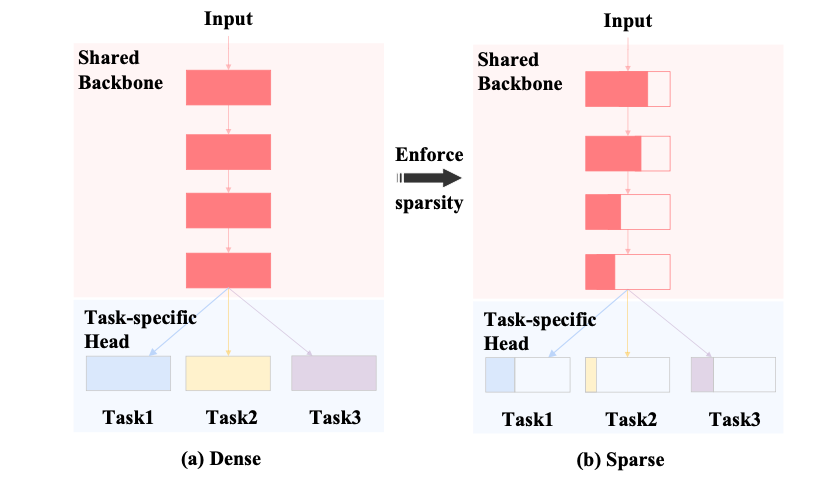

# AdapMTL: Adaptive Pruning Framework for Multitask Learning Models



AdapMTL is an adaptive pruning framework tailored for multitask learning (MTL) models. Model compression in MTL introduces unique challenges due to the need for balanced sparsity allocation and accuracy across multiple tasks. AdapMTL addresses these challenges by applying independently learnable soft thresholds to the shared backbone and task-specific heads, capturing sensitivity nuances within each component.

During training, AdapMTL co-optimizes soft thresholds and model weights to automatically determine optimal sparsity for each component, achieving both high task accuracy and overall sparsity. Additionally, it integrates an adaptive weighting mechanism that dynamically adjusts the importance of each task’s loss based on robustness to pruning. Extensive experiments on popular multitask datasets, such as NYU-v2 and Tiny-Taskonomy, across various architectures, demonstrate AdapMTL’s superior performance compared to state-of-the-art pruning methods.


## Environment Setup

Duplicate the environment from the provided YAML file:

```bash
conda env create -f environment.yml
```

## Model Training

### Option 1: Training from Scratch
```bash
python baseline.py \
    --dataset NYUV2 \
    --architecture mobilenetv2 \
    --iters 100000 \
    --lr 0.0001 \
    --decay_lr_freq 12000 \
    --decay_lr_rate 0.3 \
    --sInit_value -1000 \
    --weight_decay 0.0001\
    --ratio 0.9 \
    --save_dir ./outputs/test2/
```

**Pros:**

- Enables training from scratch with automatic sparsity introduced in the model.

**Cons:**

- Familiarity with the --sInit_value and --weight_decay parameters is crucial; finding optimal values might require experimentation.
- For example, a highly negative sInit_value (e.g., -1000) will introduce minimal sparsity, so after 15,000 iterations, the model may still be dense. Conversely, a small positive sInit_value (e.g., 10) will quickly introduce sparsity. 
- A recommended starting point is a moderate value, such as -20, or experimenting to find the best setting.


### Option 2: Training from a Dense Model or Pruned Model
This is what we do for the comparison methods too.
Please check the scripts in the `Scripts` for more details.

```
# resnet34 baseline
python baseline.py --architecture resnet34 --save_dir ./outputs/resnet34_1028/baseline/

# or load from the checkpoint
CUDA_VISIBLE_DEVICES=1 python baseline.py --architecture resnet34 --save_dir ./outputs/resnet34_1028/baseline/ --reload outputs/resnet34_1028/baseline/segment_semantic_normal_depth_zbuffer_18999.model

# resnet34 pruning
python pruning.py --prune_ratio 0.85 --architecture resnet34 --save_dir outputs/resnet34_1028/pruning/ --load_checkpoint outputs/resnet34_1028/baseline/best_segment_semantic_normal_depth_zbuffer.model

# resnet34 finetune
CUDA_VISIBLE_DEVICES=1 python finetune.py --prune_ratio 0.97
```

**Pros:**

- Save you a lot of time because you don't need to find the approprate intial values.
- You can begin with a pre-pruned model, which speeds up convergence.
  - For example, you could fine-tune a model from 60% sparsity to 90% sparsity. The idea is that, regardless of the method, a model can always be further pruned by gradually removing smaller portions of weights.

**Cons:**

- Requires training a dense or partially pruned model first before proceeding with fine-tuning.


## Model Evaluation

Please check the `Scripts/run_test.sh` for more details. Example:

```bash
python test.py \
--path ${output_path}/${ratio}/best_segment_semantic_normal_depth_zbuffer.model \
--architecture resnet34 \
--save_dir logs \
--log_name resnet34_accuracy_saprsity
```

# Project Structure
`main`: Contains all core source code. See main/trainer.py for key training, pruning, and testing code.

`Scripts`: Includes useful scripts for training, pruning, and evaluation.
logs: Contains sample results for baseline comparison.

`SOTA_methods`: Houses all comparative methods mentioned in the paper.

`logs`: Contains training results for baseline comparison.

`./args.py`: Store the default arguments.


# Visualization
By running the `baseline.py` or `finetune.py` you will typically see 3 files in the place you chose by `--save_dir`

For example, under my directory I got:
- resnet34_baseline_2023-03-11.txt
  - the training logs
- best_segment_semantic_normal_depth_zbuffer.model
  - the best model I can achieve in the training process
- events.out.tfevents.1678500354.gypsum-gpu182.683343.0
  - saved logs for tenosrboard visualization

I personally prefer using TensorBoard to monitor key metrics like `threshold`, `metrics`, and `sparsity`. Therefore, I’ve integrated TensorBoard’s writer into my training code.

These metrics are easy to view in TensorBoard. Below are some examples:

**Figure 1** displays a range of metrics, including learning rate, layer-wise sparsity, layer-wise thresholds, training loss, overall metrics, and total sparsity.


For sparsity, you can view both the total sparsity and component-wise sparsity. In this example, we’re tracking five tasks for Taskonomy.


Additionally, you can see the threshold for each convolutional layer.


# Comparison

For detailed information on state-of-the-art (SOTA) comparison results and model implementations, please refer to the **SOTA_methods** directory.

# Acknowledgments

This framework builds upon `TreeMTL`. Special thanks to Lijun Zhang for their support:

[https://github.com/zhanglijun95/TreeMTL](https://github.com/zhanglijun95/TreeMTL)

# Citation
If you use our dataset or methods, please cite our work:

```
@article{xiang2024adapmtl,
  title={AdapMTL: Adaptive Pruning Framework for Multitask Learning Model},
  author={Xiang, Mingcan and Tang, Steven Jiaxun and Yang, Qizheng and Guan, Hui and Liu, Tongping},
  journal={arXiv preprint arXiv:2408.03913},
  year={2024}
}

@inproceedings{10.1145/3664647.3681426,
  author = {Xiang, Mingcan and Tang, Jiaxun and Yang, Qizheng and Guan, Hui and Liu, Tongping},
  title = {AdapMTL: Adaptive Pruning Framework for Multitask Learning Model},
  year = {2024},
  booktitle = {Proceedings of the 32nd ACM International Conference on Multimedia},
  series = {MM '24}
}
```
